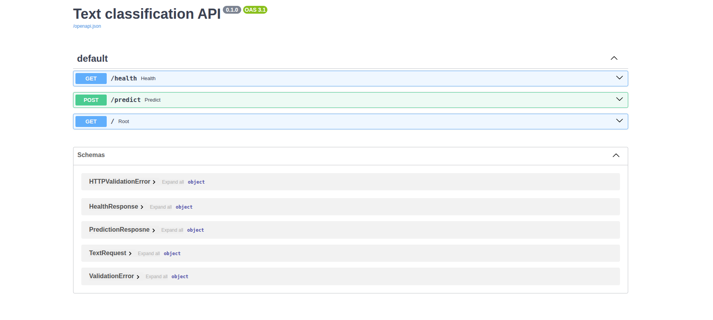
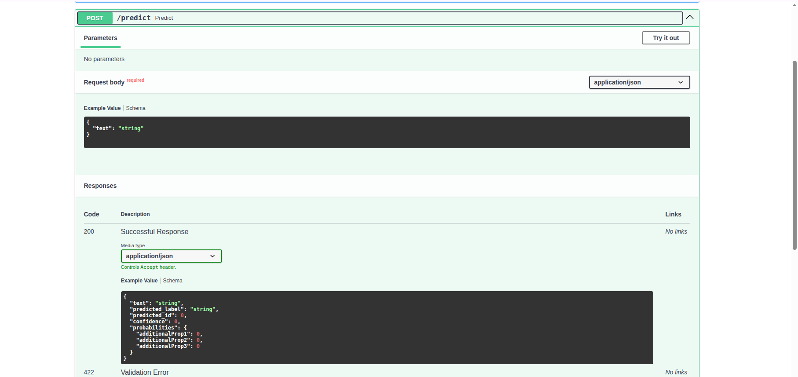
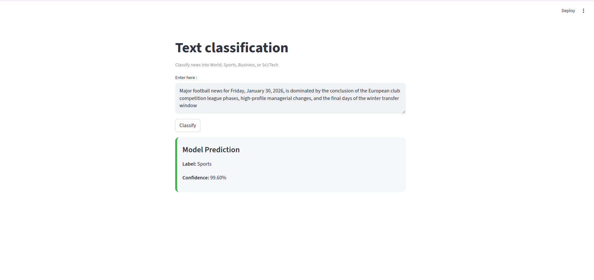

# Fine-tuning distil-bert-uncased for text classification

Here I have used ag_news database for fine-tuning the model
[ag_news](https://huggingface.co/datasets/sh0416/ag_news)  which have four classes 

which contain 120,000 train data and 
contains 76000  test data .

## CLASS NAME INFORMATION
1: `World` 2: `Sports` 3: `Business` 4: `Sci/Tech`

# FastApi UI


# /predict endpoint 


# Streamlit frontend


## Setup Instructions


### 1.  Prerequisites

- Python 3.9+

- uv (Python package manager)

### 2. Install uv
**if not installed**
```bash
pip install uv
```
## 3.Clone & Install Project
```bash 
git clone https://github.com/samirdahal888/model_finetune_project.git
cd model_finetune_project
```

## 4. Create Virtual Environment & Install Dependencies.
```bash predicted_id
uv venv
source .venv/bin/activate
uv pip install -e .
```

## 5. python script/train.py
```bash 
python script/train.py
```

## 6. Run api 
```bash 
python -m api.main
```

### After running the api you can start streamlit frontend
```bash
streamlit run streamlit_app.py
```


